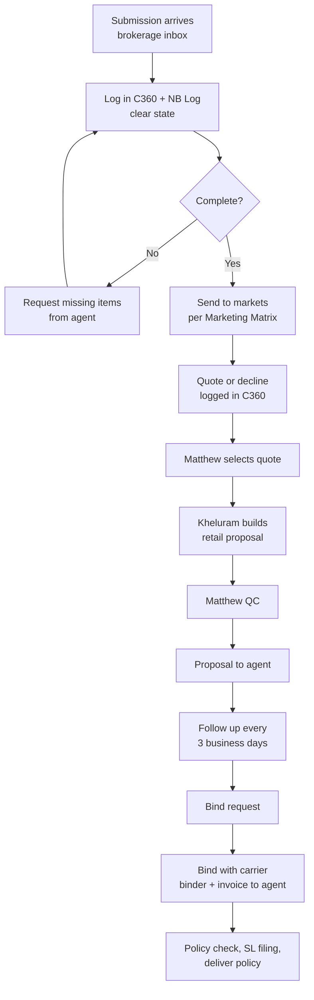

# Brokerage Service Team SOP

Sep 23, 2026 · Jacob Landman

Living version: https://claude.ai/code/artifact/2b4503e2-5960-4d8b-aee3-f14fa1b06da5

## Purpose and definition of done

Matthew Castro runs the brokerage desk end to end, with Kheluram Kumar as the second seat. Every submission, quote, bind and service request goes through **brokerage@carma365.com** and C360. Summer Jenkins-Wilson brings in the business, hands it to the service team, and reviews only the exceptions listed in this SOP.

This SOP is done when:

- Matthew and Kheluram run every brokerage file from the brokerage inbox without Summer doing the work.
- Summer's only touch points are the approvals and escalations in the Oversight section.
- No bind request, quote or service item goes past its deadline in the Timelines section.

Why now: on 9/23 Summer flagged bind orders open since 9/18, flood quotes due to Jodi that day, and C360 erroring on brokerage functions. Service work was slipping while the team tested new tools.

## Roles and ownership

Matthew owns the outcome of every brokerage file. Today each carrier quote waits for Summer to review it, pick one, and email the team which quote to send (Matt, 9/23). This SOP moves quote selection and release to Matthew, so Summer only sees exceptions.

| Person | Role | Owns | Does not do |
| --- | --- | --- | --- |
| Matthew Castro | Brokerage service lead | The brokerage inbox, C360 brokerage records and the NB Log. Market selection, quote selection, final QC on every proposal, binds, issuance, service requests. Trains and checks Kheluram. Accountable for every deadline. | Wait on Summer for anything outside the Oversight list. |
| Kheluram Kumar | Brokerage service associate | Logging new submissions, sending submissions to markets, building retail proposals, sending approved proposals, bind follow-ups, filing documents. Covers the inbox during his shift. | Release a proposal Matthew has not checked (until Matthew signs him off). |
| Summer Jenkins-Wilson | Producer, brokerage oversight | Bringing in agents and business, carrier and wholesaler relationships, appointments. Hands new business to the inbox. Decides only the items in the Oversight section. | Build proposals, send quotes, chase bind requests. |
| Jacob Landman | Executive sponsor | Mailbox and C360 access, tools, weekly review, escalations Summer can't resolve. | Day-to-day file work. |

Other referral sources (Carma underwriting, Bryan, carriers) send brokerage work to the brokerage inbox, not to a person's Teams or inbox. Accounting (premium@, ap@ and Advance) moves premium and commission money, but Matthew owns every agent question about it until the agent has an answer.

## Intake: one door for everything

All brokerage work enters and leaves through brokerage@carma365.com. If a file is not in the brokerage inbox and in C360, the team is not responsible for it.

**Before this works:** Matthew and Kheluram need full access to the brokerage shared mailbox. Matthew said on 9/23 he does not have it yet. Owner: Jacob, due Sep 24, 2026.

**Rules**

1. Agents, carriers and wholesalers send to brokerage@carma365.com. Summer already points new contacts there (IMA, 9/14); keep doing that.
2. Anything Summer, Carma underwriting or Bryan receives directly gets forwarded to the brokerage inbox the same day, with the handoff note below. No work is assigned through Teams DMs or texts. The Brokerage X Service Teams chat is for quick internal questions only; the record of every file stays in the brokerage inbox and C360.
3. All replies to agents and carriers go out from the brokerage inbox, never a personal inbox, so the thread stays visible to the whole team. Brokerage files also stay out of service@carma365.com; if one lands there, as the Ethos flood request did on 9/21, move it to the brokerage inbox.
4. Every email and document is saved to the account in C360 and to Brokerage > New Business > the Named Insured folder. Nothing is saved to a desktop.
5. If C360 errors out (as it did on 9/23), log the item in the NB Log and back-fill C360 the same day it recovers.

**Which mailbox**

| Mailbox | Use for |
| --- | --- |
| brokerage@ | Every brokerage file: submissions, quotes, binds, subjectivities, endorsements, renewals. New business no longer goes to sales@ (Summer, 9/10). |
| premium@ | Premium invoices, payments and remittance. Copy brokerage@ so the file stays complete. |
| ap@ | Commission payouts to agents. Copy brokerage@. |
| service@ | Not used for brokerage files. Anything brokerage that lands here moves to brokerage@. |

**Handoff note (Summer to the brokerage inbox)**

One short email per new account, subject `NEW BIZ – [Named Insured] – [LOB] – Eff [MM/DD/YY]`:

- Agent and agency, with email
- Lines of business and effective date
- Incumbent carrier and premium, if known
- Anything promised to the agent (markets, price, timing)
- Attachments: application, loss runs, SOV, supplementals

**File names** (match what is already in C360):

- `26-27 [LOB] - Submission Email to [Carrier]`
- `26-27 [LOB] [Carrier] QUOTE $[premium]`
- `26-27 [LOB] - Proposal to Agent`
- `26-27 [LOB] - Bind Request` / `Binder` / `Policy`

## Workflow, step by step

Every file moves through the same eight steps. Matthew selects and releases quotes. Summer steps in only on the Oversight list.

The left branch loops until the file is complete; nothing goes to market with missing items.

| # | Step | Who | Do this | Record |
| --- | --- | --- | --- | --- |
| 1 | Receive and log | Kheluram (Matthew backs up) | Reply to the agent that it's received. Create the C360 account and NB Log row. Check the state in the SLA Clearance Tool: no E&S in states where Carma has no surplus lines license. | C360 status, NB Log: Date Recd, Agent, LOB, Xdate, Incumbent |
| 2 | Complete the file | Kheluram | List what is missing (app, loss runs, SOV, supplementals, license) in one email to the agent. | NB Log status `Pending - Info Requested`, follow-up date |
| 3 | Market | Matthew picks markets, Kheluram sends | Choose carriers from the Marketing Matrix and Submission Routing Playbook by appetite, state and commission. Send from the brokerage inbox or the carrier portal (Blitz, LIO, Wholesure, Propeller). Strip the retail agent's name and contact details first; if a market asks, the retail agent is Bryan Mosser. | `Pending - Submitted to Markets`, each submission email saved to C360 |
| 4 | Quote received | Kheluram | Log every quote or decline in C360. Chase any market that hasn't answered. | Quote PDF saved, quoted premium in NB Log |
| 5 | Select quote | Matthew | Apply the selection rules below. No email to Summer unless an Oversight item applies. | Note in C360: which quote and why |
| 6 | Build proposal | Kheluram, Matthew checks | Make the ten changes in the Retail Quote Preparation Training Guide, add the Carma Quote Cover Letter and the T&F Calculator figures. Matthew runs the Final Quality Checklist. | Proposal saved to Named Insured folder and C360 |
| 7 | Send and follow up | Kheluram | Send from the brokerage inbox with cover letter, proposal and bind requirements. Follow up every 3 business days until bound, declined or expired. | `Quoted - Awaiting Bind Request`, follow-up date |
| 8 | Bind and issue | Matthew (Kheluram assists) | Check signed quote forms, signed application, subjectivities, Diligent Effort form and payment. Send the bind order to the carrier, then send binder and invoice to the agent. When the policy arrives, check it against the quote, file surplus lines, deliver it. | `BOUND`, then `BOUND - Policy Issued`; folder moved to .BOUND BUSINESS |

**Quote selection rules (step 5)**

1. The quote matches what the agent asked for: lines, limits, and property if requested.
2. The carrier is eligible for the state, and E&S is only used where the SLA Clearance Tool allows it.
3. Among quotes that pass 1 and 2, lead with the lowest total cost after Carma taxes and fees.
4. If two quotes are close or trade coverage for price, send both with a one-page marketing summary (the format Summer shared on 9/23).
5. Anything outside these rules goes to Summer under Oversight.

**Service requests** (endorsements, cancellations, audits, loss runs) follow the same inbox rules: acknowledge the same day, submit to the carrier within 1 business day, and confirm back to the agent when the carrier responds.

**Renewals** start 90 days before expiration, not when the agent asks. On the Ethos workers' comp renewal (10/31), the agent flagged the 90-day window on 8/7 and still had no clean submission on 9/22.

1. 90 days out: ask the agent for the current application, ACORDs, currently valued loss runs and a signed loss-run authorization. Send a summary of current coverage with it.
2. 60 days out: send the renewal to markets.
3. 30 days out: send the renewal proposal to the agent.
4. 15 days out with no bind request: Matthew calls the agent and tells Summer.

**Rules from this month's misses** (Summer's emails, 8/15 to 9/23)

- **Tell every market it's cannabis.** Every market must confirm it knows the insured is a cannabis business before any quote goes to the agent or client. Check that locations and limits match the SOV. The Ethos flood indication came back with three different property limits and led with NFIP, which does not insure cannabis risks.
- **Send subjectivities the day they arrive.** Send them to the carrier within 1 business day and track each one to its due date as a C360 task. The Mederi Express subjectivities arrived 9/14 and still hadn't gone to BIK by 9/23, with a 9/30 deadline.
- **Act on carrier warnings the same day.** A cancellation notice, non-pay notice or payment-draft warning gets a reply and a call to the agent that day, and Summer is told. Ethos had a $42K installment drafted after two unanswered warnings (8/12 and 8/21).
- **Follow the money to the carrier.** Confirm the agent's payment arrived and went to the carrier before the due date. SRCX (Conifer) and Plumber's Investors both cancelled after the agent had paid or mailed payment.
- **Know the billing type at bind.** Agency bill: invoice the agent net of commission, with remittance by policy. Direct bill: the carrier bills the insured and Carma only receives commission, so enter it in Advance and tell the agent how commission is paid. Refunds show the transaction type and a negative amount. The Times Sq Culture agent chased a June commission eight times, and Bud Bros was told direct bill when it wasn't.
- **Get client instructions in writing.** Add or change coverage only on the client's written instruction. Then confirm the carrier issued the endorsement and send it to the client.

## Timelines

The team is measured on these deadlines. Three come from Summer's Brokerage SOP and three from her emails; the rest are proposed to fill gaps and need her sign-off.

| Event | Deadline | Owner | Source |
| --- | --- | --- | --- |
| Carrier cancellation, non-pay or payment-draft notice | Reply and call the agent the same day, and tell Summer | Matthew | Summer's emails |
| Bind request received | Confirmed to agent and bind order to carrier the same business day | Matthew | Proposed |
| Carrier binder received | Binder and invoice to agent within 1 business day | Matthew | Proposed |
| Subjectivities received from agent | Sent to carrier within 1 business day, tracked to the carrier's due date | Kheluram | Proposed |
| Premium received from agent | Paid to the carrier before its due date, with remittance by policy | Matthew with premium@ | Proposed |
| Agent asks about the same item a second time | Matthew calls the agent that day instead of emailing again | Matthew | Summer, 9/23 |
| Carrier quote or decline received | Logged in C360 the same day | Kheluram | Summer's SOP |
| Carrier quote received | Retail proposal to agent within 1 business day | Kheluram builds, Matthew releases | Summer's SOP |
| Proposal sent, no bind request yet | Follow up with agent every 3 business days | Kheluram | Summer's SOP |
| Renewal 90 days out | Renewal request and coverage summary to the agent | Kheluram | Summer's emails |
| Renewal 60 days out | Renewal sent to markets | Matthew | Proposed |
| Renewal 30 days out | Renewal proposal to the agent | Kheluram builds, Matthew releases | Proposed |
| New submission received | Acknowledged and logged the same business day | Kheluram | Proposed |
| Submission incomplete | One missing-items email the same business day | Kheluram | Proposed |
| Submission complete | Sent to markets within 1 business day | Matthew | Proposed |
| Market has not responded | Chase after 3 business days | Kheluram | Proposed |
| Service request received | Acknowledged same day, to carrier within 1 business day | Kheluram | Proposed |
| Policy received from carrier | Checked against quote and delivered within 2 business days | Matthew | Proposed |
| Effective date within 5 business days | Rush: moves to the top of the queue, Matthew handles | Matthew | Proposed |

Carrier warnings, bind requests and rush files always come first. A missed deadline is flagged before it passes, per the Oversight section, not after.

## Summer's oversight

Summer approves only the items below. Everything else Matthew decides and releases himself. To ask for a decision, Matthew emails the brokerage inbox, subject `SUMMER APPROVAL – [Named Insured]`, with his recommendation. Summer answers the same business day.

**Needs Summer's approval**

- Premium of $40,000 or more. The admin fee is 3% of premium and needs management approval before the proposal goes out (Admin Fee Schedule).
- A market that is not in the Marketing Matrix, or needs a new appointment (for example, Earth Quality Products needs a Kinsale appointment).
- Leading with a quote that gives up coverage the agent asked for, such as property excluded.
- The first two files in any line the team hasn't written before. Flood for Ethos is the current one.
- Declining an account Summer brought in, or telling an agent Carma can't place it.
- Any agent complaint or relationship issue.

**Never allowed, no approval needed to say no**

- Giving any carrier, wholesaler or MGA our retail agent's name or contact details. If a market asks, list Bryan Mosser as the retail agent. Blitz has been asking; it is an MGA, a trading partner and a competitor (Summer, 9/23).
- An admin fee below the band minimum.
- E&S business in a state flagged in the SLA Clearance Tool.
- Carrier contact details, carrier tax lines or total commission on a retail proposal.
- Releasing a quote before the market has confirmed it knows the risk is cannabis.

**Escalation**

1. If a deadline in Timelines will be missed, Matthew tells Summer before it passes, with the file name and new date.
2. If Summer hasn't answered an approval by end of day, Matthew escalates to Jacob.
3. A system problem (C360 error, mailbox access, portal login) goes to Jacob the same day, and the file goes on in the NB Log.

**Ramp-down of Summer's review**

| Period | Summer's review |
| --- | --- |
| Weeks 1–2 | 15-minute daily check of every proposal Matthew released that day, after it is sent. Feedback in writing. |
| Weeks 3–4 | Spot-check 3 files a week, plus the approval list. |
| Week 5 on | Approval list and the weekly pipeline review only. |

## Daily and weekly cadence

The team is held to one daily report and one weekly review. The scorecard below is what Summer and Jacob check.

**Daily**

| When | Who | What |
| --- | --- | --- |
| Start of day | Matthew | Triage the brokerage inbox: carrier warnings, bind requests and rush files first, then quotes received, then new submissions. Every new email is assigned to Matthew or Kheluram. |
| Kheluram's shift | Kheluram | Work his queue in the order above, from the NB Log follow-up dates. |
| End of day | Matthew | Every open file has a C360 status and a follow-up date. Send the end-of-day email below. |

**End-of-day email** (Matthew to Summer, cc Jacob, from the brokerage inbox)

- Bound today
- Proposals sent today
- Bind requests or quotes still open, with age in days
- Anything stuck and what is needed to unstick it

**Weekly pipeline review** (Monday, 30 minutes, Matthew, Kheluram, Summer, Jacob)

Walk the C360 pipeline report: New Business, Follow Up, Quote, Closed, Declined. Today's board shows 43 in New Business, 30 in Follow Up and 35 quoted and awaiting bind. Any file past its deadline gets an owner and a date in the meeting.

**Scorecard**

| Measure | Target |
| --- | --- |
| Bind requests not actioned the same business day | 0 |
| Carrier quotes not proposed to the agent within 1 business day | 0 |
| New submissions not logged the same day | 0 |
| Open files with no follow-up date | 0 |
| Files Summer had to work herself | 0 |

**C360 gap:** there is no C360 status for quote received, proposal pending (Matthew, 9/23). Until one is added, use `Quote Received - Proposal Pending` in the NB Log so those files show up in the daily triage.

## Backlog catch-up plan

The backlog gets cleared before anything else, including new tools. That is Summer's ask from 9/23, and it comes first in the week.

**This week, in this order**

- [ ] Give Matthew and Kheluram full access to the brokerage inbox. Jacob, Sep 24, 2026
- [ ] Work every bind order open since 9/18, oldest first, and confirm each one to the agent. Matthew, Sep 24, 2026
- [ ] Release the quote that has been ready since 9/18. Matthew, Sep 24, 2026
- [ ] Mederi Express: send the title receipt and plate numbers to BIK, confirm the receipt is acceptable in place of titles, and request the policy. Subjectivities are due 9/30. Matthew, Sep 24, 2026
- [ ] Times Sq Culture: call Jennifer Lazo at NY Capital, apologize, and stay on it until her June commission is paid. Matthew, Sep 24, 2026. Jacob decides on paying it while accounting traces the funds.
- [ ] Ethos flood: get firm Neptune and NFIP quotes with cannabis confirmed, then send the formal quote to Jodie. Summer sent the indication 9/23 and is holding the formal quote. Kheluram with Summer, Sep 24, 2026
- [ ] Ethos workers' comp renewal (10/31): send Gene at Flux a clean ACORD 130 and the corrected class-code spreadsheet he asked for on 9/22. Matthew, Sep 25, 2026
- [ ] Confirm the two rush submissions to Blitz and LIO (Summer, 9/22) went out. Kheluram, Sep 24, 2026
- [ ] Send a bind follow-up on each of the 35 quoted files. Kheluram, Sep 25, 2026
- [ ] Check every bound file for open subjectivities, unpaid premium and unissued endorsements. Log each with its due date. Kheluram, Sep 28, 2026
- [ ] Chase every market on the 30 Follow Up files that hasn't answered in 3 business days. Kheluram, Sep 28, 2026
- [ ] Confirm the RPS appointment is active again; RPS reported the agency suspended while the MLH Kinsale change was open. Summer, Sep 28, 2026
- [ ] Review the 43 New Business files: marketed, waiting on info, or closed. Matthew, Sep 30, 2026

**Setup**

- [ ] Summer signs off the proposed timelines and the Oversight list. Summer, Sep 25, 2026
- [ ] First weekly pipeline review. All four, Sep 28, 2026
- [ ] Pause work on the proposal tool until the bind and quote backlog is clear. Matthew, now
- [ ] Ask the dev team for a C360 status for quote received, proposal pending, and a fix for the brokerage errors. Jacob, Sep 30, 2026

## Training library

Each step has one resource to learn from. Kheluram is signed off on a step once Matthew has checked 5 of his files at that step with no corrections.

| Step | Resource | Covers |
| --- | --- | --- |
| All | [Brokerage SOP (zip)](https://carma365-my.sharepoint.com/personal/summer_carma365_com/Documents/Microsoft%20Teams%20Chat%20Files/Brokerage%20SOP.zip) | Summer's New Business Process Flow, document control rules and timelines |
| All | [Brokerage Training recording, 9/22](https://carma365-my.sharepoint.com/:v:/p/summer/IQCmbUVaFYcFRLktA6Y2DUpLAQagXEecP8hr54SPYentW9o) | 47-minute session with Summer, Kheluram and Jacob |
| All | [Onboarding recording, 9/16](https://carma365-my.sharepoint.com/:v:/p/jacob/IQBQdghGN5cGSa7jRskVpt2rAQzx9QA_jCRewiuej4997NA) | Matthew, Kheluram and Jacob: C360, VPN, routing playbook |
| 1 | [SLA Clearance Tool](https://carma365-my.sharepoint.com/personal/summer_carma365_com/Documents/Microsoft%20Teams%20Chat%20Files/SLA_Clearance_Tool%204.html) | States where Carma cannot write E&S |
| 1, 7 | [NB Log](https://carma365.sharepoint.com/sites/Brokerage/Shared%20Documents/NB%20Log%20-%20Updated%202026-09-23.xlsx) and [C360](https://c360.carma365.com/) | Where every file is logged and tracked |
| 3 | [Marketing Matrix](https://carma365.sharepoint.com/sites/Brokerage/Shared%20Documents/Marketing%20Matrix.xlsx) | Carrier appetite, states, contacts, total and retail commission |
| 3 | [Submission Routing Playbook](https://carma365.sharepoint.com/:x:/r/sites/Brokerage/_layouts/15/Doc.aspx?sourcedoc=%7B2BC8C01D-497A-4826-A7A3-2D046B8B21CC%7D&file=CARMA_Brokerage_Submission_Routing_Playbook_2026-08-24.xlsx&action=default) | Which markets get which submissions |
| 5, 7 | [Marketing Summary example](<https://carma365-my.sharepoint.com/personal/summer_carma365_com/Documents/Microsoft%20Teams%20Chat%20Files/Marketing%20Summary%20(002).pdf>) | The side-by-side market comparison Summer wants for brokerage |
| 6 | [Retail Quote Preparation Training Guide](https://carma365-my.sharepoint.com/personal/summer_carma365_com/Documents/Microsoft%20Teams%20Chat%20Files/Retail_Quote_Preparation_Training_Guide.pdf) | The ten changes, Admin Fee Schedule, math check, filing rules, final checklist |
| 6 | [Brokerage Training – Send Quote, Conifer (zip)](https://carma365-my.sharepoint.com/personal/summer_carma365_com/Documents/Microsoft%20Teams%20Chat%20Files/Brokerage%20Training%20-%20Send%20Quote_Conifer%201.zip) | Summer's walkthrough of a Conifer quote to proposal |
| 6 | [T&F Calculator](https://carma365.sharepoint.com/sites/Brokerage/Shared%20Documents/Compliance/SLA/Carma_SLA_Master_License_and_TF.xlsx) | Surplus lines tax and fee rates by state |
| 7 | [Carma Quote Cover Letter](https://carma365-my.sharepoint.com/personal/summer_carma365_com/Documents/Microsoft%20Teams%20Chat%20Files/Carma%20Quote%20Cover%20Letter.docx) | Cover letter sent with every proposal |
| 8 | [Surplus Lines Compliance Guide](https://carma365.sharepoint.com/sites/Brokerage/Shared%20Documents/Compliance/SLA/Surplus_Lines_Compliance_Guide_CORRECTED.docx) | Filing rules after bind, all 51 jurisdictions |

## Sources

Built from Jacob's Teams chats with Summer, Matthew and Kheluram (9/11 to 9/23), about 40 brokerage email threads Summer sent or copied Jacob on (8/15 to 9/23), the files above, and the [brokerage pipeline board](https://carma365-my.sharepoint.com/personal/matt_carma365_com/Documents/Microsoft%20Teams%20Chat%20Files/brokerage_pipeline_board_2026-09-23.xlsx) from 9/23. The 9/22 training transcript could not be read because transcript access is turned off for the Carma tenant. Only the timelines table of the Brokerage SOP zip could be read.
